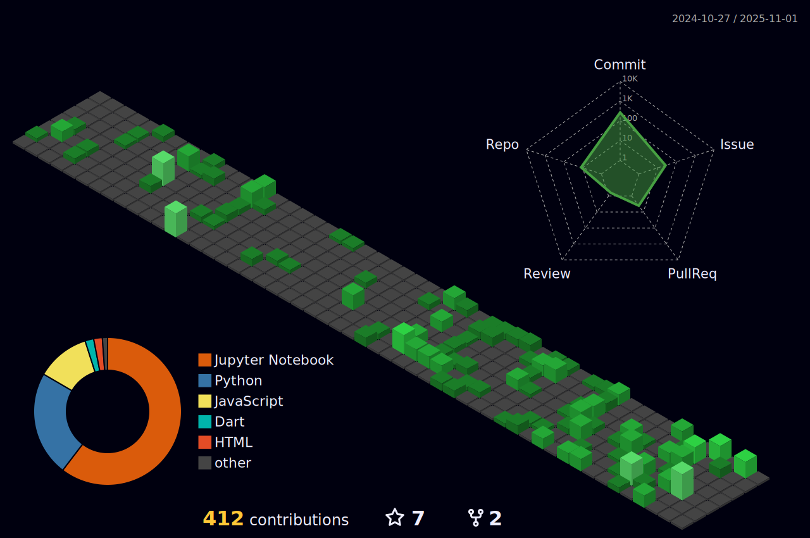

<h1 align="center">Hi 👋 and नमस्ते (Namaste) 🙏 , I'm <a href = "https://www.linkedin.com/in/rabin-bishwokarma/">Rabin Bishwokarma</a></h1>

#### About Me
- MSc Data Science student at **Friedrich-Alexander-Universität Erlangen-Nürnberg**
- CSIT Undergrad from **Tribhuvan University**
- Passionate about **Data Science and Machine Learning**
- 🔭 I’m always exploring **Data Science Techniques and Tools**
- 🌱 I’m currently learning **Mathematics as a foundation of Data Science**
- 👯 I’m looking to collaborate on **Newer Data Science projects**
- 💬 Ask me about **Data Science and Machine Learning, Python**
- 😄 Pronouns: He/Him/His
- 📫 How to reach me: **rabinbk588@gmail.com**
- ⚡ Fun fact: **I love Martial Arts, Kung-Fu and Nature**
- 🩸 Philosophy of life: **Per aspara, ad astra**
- 📋 My Portfolio: **www.rabinbk.com.np**

<!--  -->

### Blogs and articles
* **[www.rabinbk.com.np/blog/](http://www.rabinbk.com.np/blog/)**
* **[Medium](https://r-alpha919.medium.com/)**

### 🛠️ Languages and Tools I Use

<table>
  <tr>
    <td align="center" width="140">
      
       Python
    </td>
    <td align="center" width="140">
      
       PyTorch
    </td>
    <td align="center" width="140">
      
       NumPy
    </td>
    <td align="center" width="140">
      
       Pandas
    </td>
    <td align="center" width="140">
      
       Scikit-Learn
    </td>
  </tr>
  <tr>
    <td align="center" width="140">
      
       Docker
    </td>
    <td align="center" width="140">
      
       Git
    </td>
    <td align="center" width="140">
      
       MySQL
    </td>
    <td align="center" width="140">
      
       OpenCV
    </td>
    <td align="center" width="140">
      
       Postman
    </td>
  </tr>
  <tr>
    <td align="center" width="140">
      
       C
    </td>
    <td align="center" width="140">
      
       C++
    </td>
    <td align="center" width="140">
      
       Heroku
    </td>
    <td align="center" width="140">
      
       Jekyll
    </td>
  </tr>
</table>

 

### Show some ❤️ by starring ⭐ some of the repositories!

